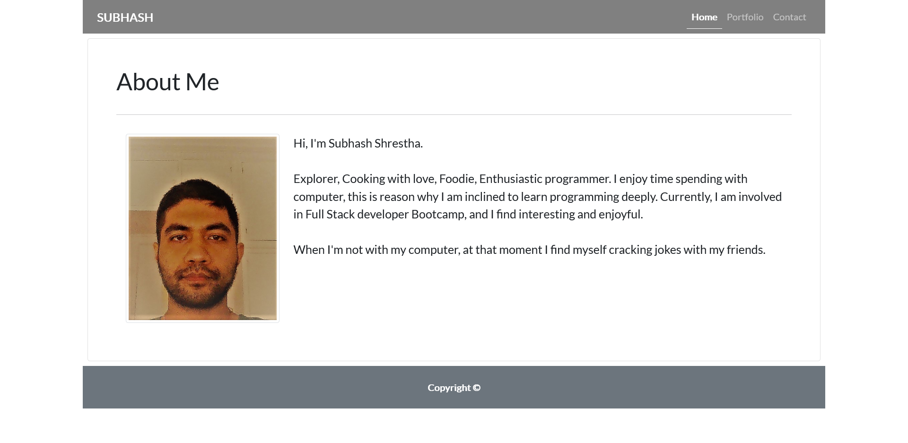
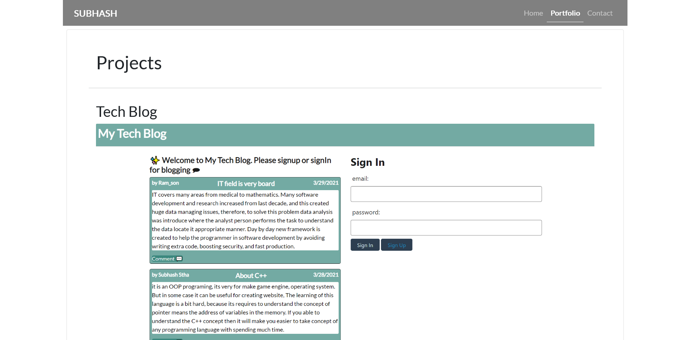
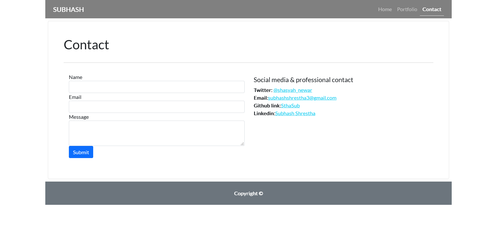

   #  My React Portfolio

   ## Introduction
      This application designed to show the personal portfolio containing
      contact details, skills, projects, and about person.  

   ## List of technologies used
      Javascript, CSS, Nodejs, React

   ## Screenshots
   ## Home
   
   ## Portfolio
   
   ## Contact
   

   ## License
   
   
   ## Live link to deployed app
   [My React Porfolio](https://SthaSub.github.io/my-react-portfolio)
   
   ## Contact information
   if you have questions then please feel free to contact on these addresses,
   
   Github: [SthaSub](https://github.com/SthaSub)
  
   Email: [subhashshrestha3@gmail.com](subhashshrestha3@gmail.com)